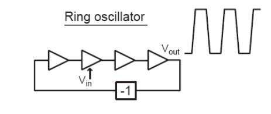
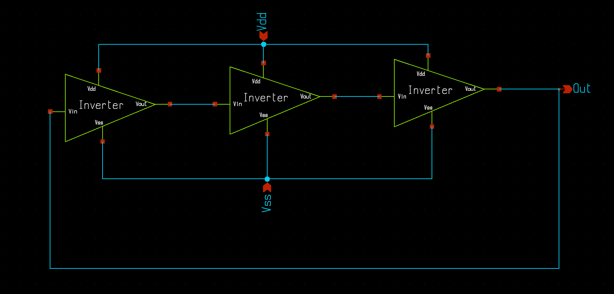
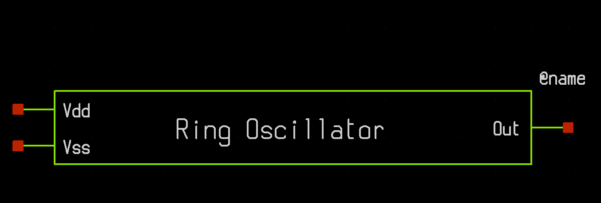
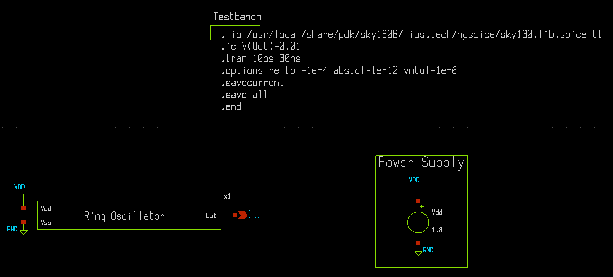
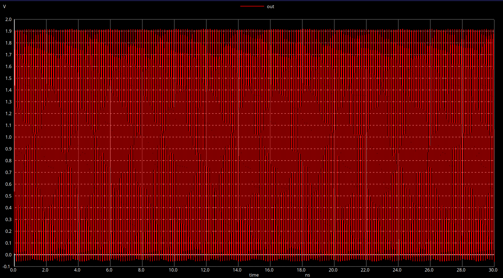
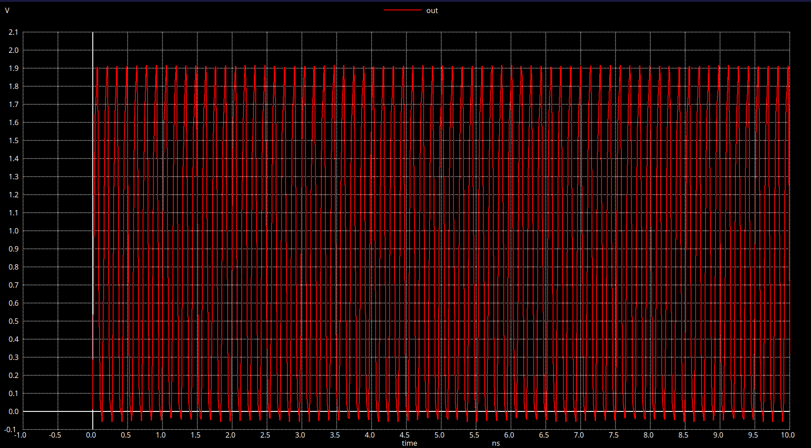
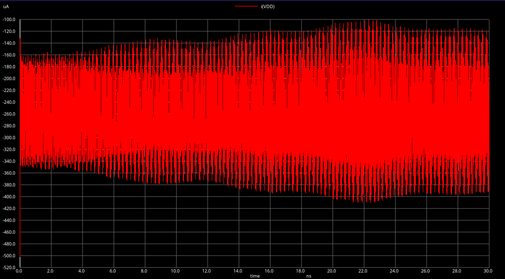

# Design and Analysis of Ring Oscillator using sky130 FOSS

This repository contains the designing of a 3-stage Ring Oscillator with the entire desing based on the custom designed [inverter](https://github.com/Krishanu-007/cmos_inverter_sky130.git). This repository contains the entire flow starting from the schematic design till the creation of the GDS II version.

I have tried keeping the operating frequency of the oscillator above 1 GHz. However the final layout is yet to be verified.


# 📚 Contents

| Section | Description |
|--------|-------------|
| [Progress](#progress) | Current status of the design |
| [Getting Started](#getting-started) | How to set up tools and run simulations |
| [Pre-Layout Analysis](#pre-layout-analysis) | Analysis of the Inverter|
| [Ring Oscillator](#ring-oscillator) | Concept, schematic, and operation |
| [Ring Oscillator Analysis](#ring-oscillator-analysis) | Pre-layout analysis of the ring oscillator |

---
## Progress 

| Jobs             | Status                                                                |
| ----------------- | ------------------------------------------------------------------ |
| Inverter Analysis| ✅ Completed   |
| Schematic Design | ✅ Completed   |
| Layout Design |   ❌ To be started |
| Layout vs Schematic(LVS) |  ❌ To be started |

---
## Getting Started

To get a hands-on on this project:

```bash
  git clone https://github.com/Krishanu-007/ring_oscillator_sky130.git
  cd ring_oscillator_sky130
```
Ensure to have all the necessary tools:
```bash
 Xschem
 Ngspice
 Magic VLSI
 Netgen
 ```
 To install all the tools please refer to my another repository named: [transistor_analysis_sky130](https://github.com/Krishanu-007/transistor_analysis_sky130)

**Open the schematic**:  
- Launch Xschem and open the `inv.sch` file located in the `Xschem` directory. This file contains the schematic of the CMOS inverter.
- You can view the symbolic representation of the inverter by opening the `inv.sym` file in the same directory.
- Launch Xschem and open the `Ring_Osc_3.sch` file located in the `Xschem` directory. This file contains the schematic of the Ring Oscillator.
- You can view the symbolic representation of the Ring Oscillator by opening the `Ring_Osc_3.sym` file in the same directory.
- The resulting test bench schematic is available in the `RO_3_test.sch` file.

**Run simulations**:
- first, ensure Ngspice is installed and configured correctly.
- On the schematic editor press `shift+a` to activate the netlist viewer
- Click on `Netlist` Icon then save the netlist, I have saved it in the `Simulation/Pre-LayoutAnalysis` directory with the corresponding name i.e. `RO_3_test` folder.
- As the simulation is done you can view the results by following the necessary steps in Ngspice.

**Layout and LVS (future work)**:
- The layout design is to be done in future. Once completed, the layout will be able to open in Magic VLSI.
- After the layout is created, you can run LVS using Netgen to verify that the layout matches the schematic.


---
## Pre-Layout Analysis
This section covers the detailed analysis of the designed CMOS inverter used in the ring oscillator. The analysis includes various performance metrics such as voltage transfer characteristics (VTC), noise margins, propagation delay, and power consumption.

The inverter is designed using the Sky130 PDK with specific transistor sizing to achieve optimal performance. The analysis is performed using Ngspice simulations based on the schematic design created in Xschem.

As the inverter is the fundamental building block of the ring oscillator, understanding its characteristics is crucial for predicting the overall behavior of the oscillator circuit.

The inverter designed is a custom one and the entire analysis is done from scratch. The inverter is designed to operate at a supply voltage of 1.8V, which is standard for the Sky130 process. To know details about the inverter please refer to my another repository named: [cmos_inverter_sky130](https://github.com/Krishanu-007/cmos_inverter_sky130.git). However the summary of the pre-layout analysis of the inverter is given below:

<div align="center">

| **Parameter** | **Value** |
|--------------|-----------|
| **Cells Used** | Standard `1.8V` `nfet` and `pfet` |
| **Vth** | `0.882 V` |
| **VIL** | `0.756 V` |
| **VIH** | `1.001 V` |
| **VOL** | `0.069 V` |
| **VOH** | `1.747 V` |
| **NML** | `0.687 V` |
| **NMH** | `0.746 V` |
| **tpHL** | `37.542 ps` |
| **tpLH** | `44.61 ps` |
| **t_pd** | `41.07 ps` |
| **t_r** | `0.13 ns` |
| **t_f** | `0.136 ns` |
| **Power** | `17 µW` |

</div>

---
## Ring Oscillator
A ring oscillator is a type of electronic oscillator that consists of an odd number of inverters connected. In this case, a 3-stage ring oscillator is designed using the custom CMOS inverter. The odd number of inverters ensures that the output of the last inverter is always the opposite of the input to the first inverter, creating a feedback loop that generates oscillations.

The operation of the ring oscillator is based on the propagation delay of the inverters. When the input to the first inverter changes state, it takes a certain amount of time for this change to propagate through each inverter stage. Since there are three inverters, the total delay for a complete oscillation cycle is three times the propagation delay of a single inverter.(ideally)
<p align="center">
  
</p>


The frequency of oscillation (f) can be approximated using the formula:
f = 1 / (2 * N * t_pd)
where:
- N is the number of inverter stages
- t_pd is the propagation delay of a single inverter 

### Schematic
The schematic of the 3-stage ring oscillator is created in Xschem, as shown below:
<p align="center">
    
</p>

The schematic consists of three CMOS inverters connected in series, with the output of the last inverter fed back to the input of the first inverter. The circuit is powered by a 1.8V supply voltage (VDD) and includes a ground reference (GND). The output of the ring oscillator can be observed at the output node of the last inverter.

### Symbol
The symbolic representation of the 3-stage ring oscillator is created in Xschem, as shown below:
<p align="center">
    
</p>
The symbol provides a simplified view of the ring oscillator, making it easier to integrate into larger circuit designs. It includes pins for connecting to other components in the circuit.

### Test Bench
A test bench schematic is created to simulate and analyze the performance of the ring oscillator. The test bench includes the ring oscillator symbol, power supply, and measurement probes to observe the output waveform. The test bench schematic is shown below:
<p align="center">
    
</p>
The test bench allows for the simulation of the ring oscillator's operation, enabling the observation of its oscillation frequency and waveform characteristics.

---
## Ring Oscillator Analysis
The pre-layout analysis of the 3-stage ring oscillator is performed using Ngspice simulations based on the schematic design created in Xschem. The analysis focuses on key performance metrics such as oscillation frequency, waveform characteristics, and power consumption.

### Oscillation Frequency
The oscillation frequency of the ring oscillator is determined by measuring the time period of the output waveform. The output waveform is observed at the output node of the last inverter in the ring oscillator. The frequency can be calculated using the formula:

<p align="center">
  
</p>

The above waveform shows the oscillations of the ring oscillator. The time period (T) is measured from one rising edge to the next rising edge of the output waveform. 10 such periods are measured to get an accurate average time period. The frequency (f) is then calculated as the reciprocal of the time period (f = 1/T).

- **Frequency calculated** = `7.06 GHz (approx)`

<p align="center">
  
</p>

Even though the oscillations are to be limitted within 1.8V and 0V, due to the non-idealities of the inverter the oscillations are seen to be going beyond these limits. This is due to the fact that the output of one inverter is directly connected to the input of the next inverter without any buffering or level shifting. As a result, any overshoot or undershoot in the output voltage of one inverter can propagate through the subsequent inverters, leading to voltage levels that exceed the intended supply voltage (VDD) and ground (GND) levels.

- **Max Voltage**: `1.91 V`
- **Min Voltage**: `-0.06 V`

The rise and fall times of the output waveform are also measured to assess the switching speed of the ring oscillator. The rise time (t_r) is defined as the time taken for the output voltage to transition from 10% to 90% of its final value, while the fall time (t_f) is the time taken for the output voltage to transition from 90% to 10% of its final value.
- **Rise Time (t_r)**: `31.20 ps`
- **Fall Time (t_f)**: `25.61 ps`

This slight asymmetry in rise and fall times can be attributed to the differences in the drive strengths and capacitances of the PMOS and NMOS transistors used in the CMOS inverter design.

Talking about the power consumption of the ring oscillator, it is essential to consider both dynamic and static power components. The dynamic power consumption is primarily due to the charging and discharging of load capacitances during switching events, while static power consumption arises from leakage currents in the transistors when they are in a steady state.

<p align="center">
  
</p>
From the above waveform, the current drawn from the power supply (VDD) is observed. The average current (I_avg) can be calculated by measuring the area under the current waveform over a complete oscillation cycle and dividing it by the time period (T). The power consumption (P) can then be calculated using the formula: `P = VDD * I_avg` 

- **Power Consumption**: `481 µW (approx)`


There are some striking observations from the analysis of the ring oscillator:
1) The Power consumption of the ring oscillator is significantly higher than that of a single inverter. This is expected, as the ring oscillator consists of multiple inverters switching continuously at a high frequency, leading to increased dynamic power dissipation.

To understand this better, a detailed quantitative analysis is provided:
#### Summary
- **Single inverter (measured)**  
  - Power: **17 µW**   
  - Maximum switching frequency (given): **24.4 GHz**

- **3-stage ring oscillator (measured)**  
  - Total power: **481 µW**  
  - Oscillation frequency: **7.06 GHz**

The RO draws **~481 / 17 ≈ 28.3×** more power overall. This document shows why that is expected, gives a quantitative capacitor-based explanation, and shows ngspice checks to reproduce/verify the analysis.

#### Governing equations
The dominant term for CMOS dynamic power is:

\[
P_{dyn} = \alpha\, C_L\, V_{DD}^2\, f
\]

where:
- \(\alpha\) = activity factor (fraction of time a node switches). For a free-running RO \(\alpha \approx 1\).
- \(C_L\) = effective capacitance at the switching node.
- \(V_{DD}\) = supply voltage.
- \(f\) = switching frequency (for a ring oscillator node toggling at \(f\), use \(f_{RO}\) directly).

For an odd \(N\)-stage ring oscillator:
\[
T = \frac{1}{f_{RO}} = 2 N\, t_{pd} \quad\Rightarrow\quad
t_{pd} = \frac{1}{2 N f_{RO}}
\]

#### Numeric Analysis (with f_RO = 7.06 GHz)

##### 1) RO period and per-stage delay
- Measured oscillation frequency:
  \[
  f_{RO} = 7.06\ \text{GHz} = 7.06 \times 10^{9}\ \text{Hz}
  \]

- Oscillation period:
  \[
  T = \frac{1}{f_{RO}} = \frac{1}{7.06 \times 10^{9}}
  = 1.416 \times 10^{-10}\ \text{s} = 141.64\ \text{ps}
  \]

- For a 3-stage ring oscillator (\(N=3\)):
  \[
  t_{pd,RO} = \frac{T}{2N} = \frac{141.64\ \text{ps}}{6}
  = 23.61\ \text{ps (per stage)}
  \]

**Result:** each inverter in the RO contributes an average propagation delay of ~**23.61 ps**.
**Note:** The inverter delay measured in isolation (~41 ps) differs from the effective per-stage delay inferred from the RO (~23.61 ps). This is due to differences in loading conditions: in the RO each inverter directly drives the next stage’s input capacitance, while in the standalone measurement the load was lighter. Hence the delay extracted from frequency is smaller.

##### 2) Per-stage RO power
- Total measured RO power:
  \[
  P_{RO} = 481\ \mu\text{W}
  \]

- Divide by number of stages:
  \[
  P_{\text{stage,RO}} = \frac{481}{3} = 160.33\ \mu\text{W}
  \]

##### 3) Effective capacitance per RO stage
Using the CMOS dynamic power model:
\[
P = \alpha \, C \, V_{DD}^2 \, f
\]
with \(\alpha = 1\) (continuous toggling) and \(V_{DD} = 1.8\ \text{V}\):

\[
C_{\text{eff}} = \frac{P_{\text{stage,RO}}}{V_{DD}^2 f_{RO}}
= \frac{160.33 \times 10^{-6}}{(1.8^2)(7.06 \times 10^9)}
\]

\[
= \frac{1.6033 \times 10^{-4}}{3.24 \times 7.06 \times 10^9}
= 7.0 \times 10^{-15}\ \text{F}
\]

**Result:** each RO stage effectively drives ≈ **7.0 fF** of capacitance.

##### 4) Capacitance from single-inverter measurement
- Single-inverter power: \(P_{inv} = 17\ \mu\text{W} = 1.7\times10^{-5}\ \text{W}\)  
- Maximum switching frequency: \(f_{\text{inv,max}} = 24.4\ \text{GHz}\)

\[
C_{inv} = \frac{P_{inv}}{V_{DD}^2 f_{\text{inv,max}}}
= \frac{1.7 \times 10^{-5}}{3.24 \times 24.4 \times 10^{9}}
= 2.15 \times 10^{-16}\ \text{F} = 0.215\ \text{fF}
\]

**Result:** the single inverter test saw only ~**0.215 fF** of load.

##### 5) Ratio of effective capacitances
\[
\frac{C_{\text{eff}}}{C_{inv}} = \frac{7.0}{0.215} \approx 32.6
\]

**Interpretation:** each inverter inside the RO sees ~**33× larger capacitance** than the isolated inverter test.

##### 6) Predicting RO power from single-inverter data
Scaling the single inverter result:

\[
P_{\text{stage,pred}} = P_{inv} \times
\left(\frac{C_{\text{eff}}}{C_{inv}}\right) \times
\left(\frac{f_{RO}}{f_{\text{inv,max}}}\right)
\]

\[
= 17\ \mu\text{W} \times 32.6 \times \frac{7.06}{24.4}
\]

Step by step:
- \(32.6 \times (7.06/24.4) = 9.42\)
- \(17 \times 9.42 = 160.1\ \mu\text{W}\)

Per stage: ~**160 µW**  
Total RO: \(3 \times 160 = 480 µW\)

##### 7) Consistency check
- **Predicted RO power:** ~**480 µW**  
- **Measured RO power:** **481 µW**

The match is excellent → the power difference is fully explained by:
1. Larger effective capacitance in the RO (~7.0 fF vs 0.215 fF), and  
2. Continuous toggling at GHz frequency (\(\alpha \approx 1\)).


Now there's another interesting observation:
2) The rise time and fall time of the ring oscillator output are significantly faster than those of a single inverter. This is because in the ring oscillator, each inverter stage is driving the input of the next inverter. Whereas for the inverter analysis, the input signal was a pulse signal with a defined signal rise and fall time of `500 ps`. This means that the inverter in the ring oscillator is switching more rapidly due to the direct coupling between stages, leading to faster transitions at the output.

---